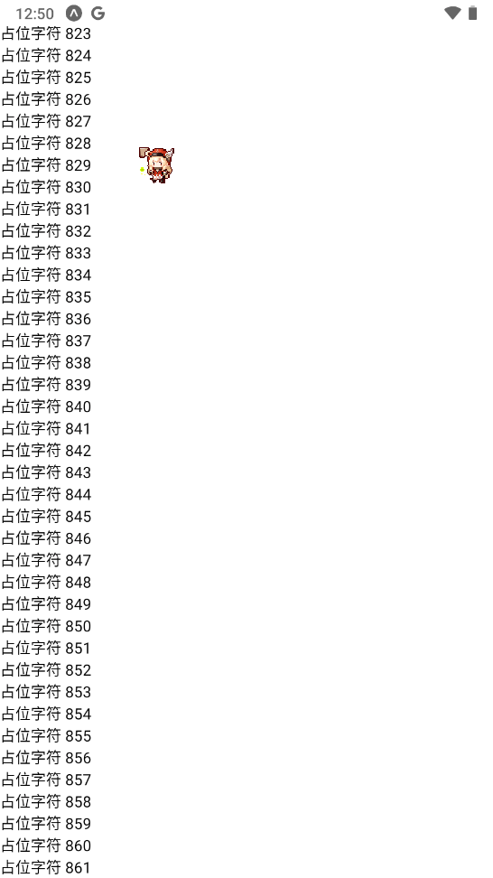
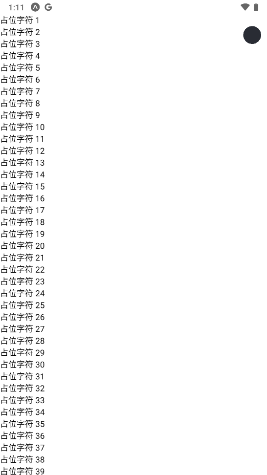
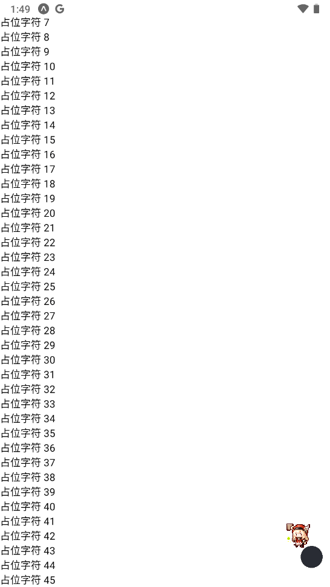
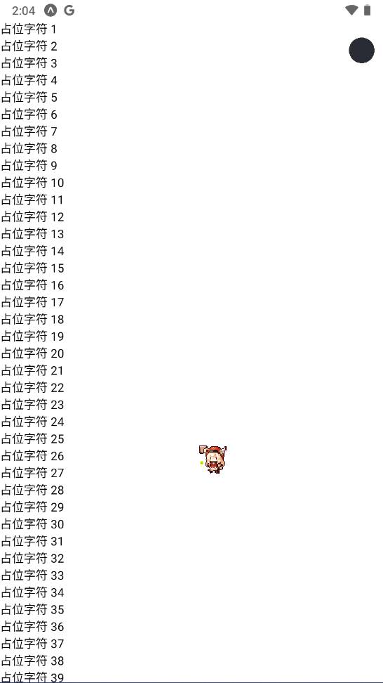
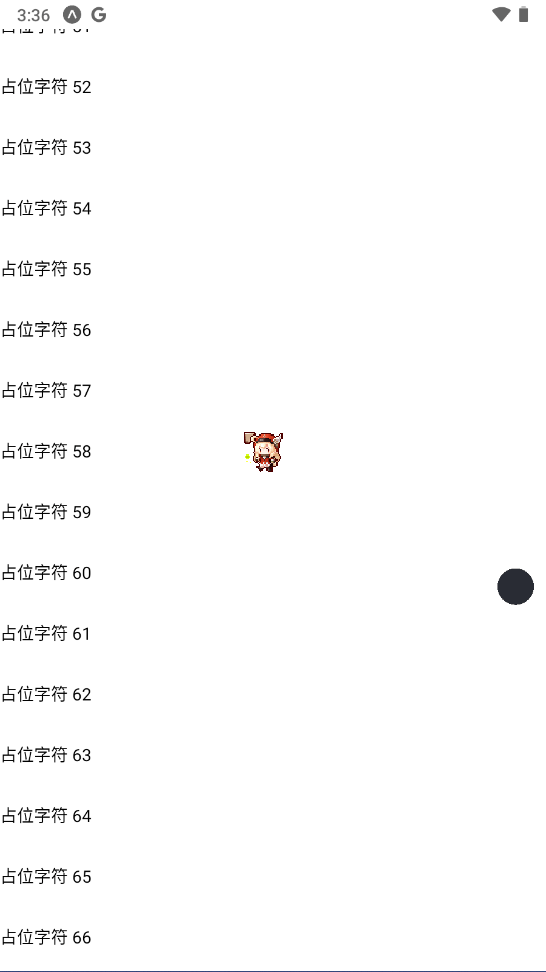
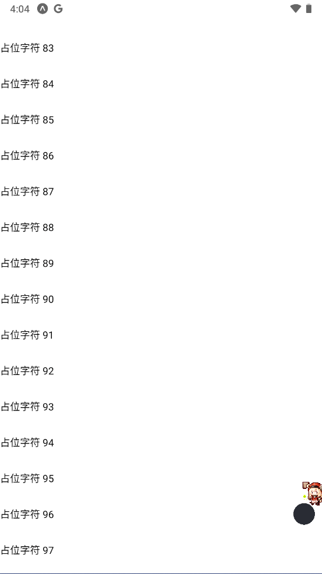
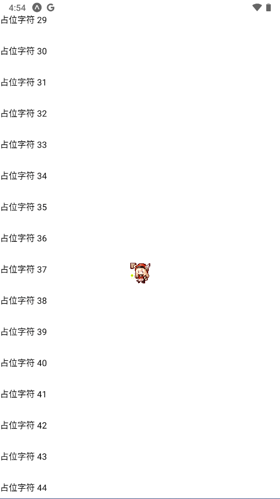

# 前言

在使用react native的flatlist组件时, 我发现它的滚动条在手机上的行为并不像web端那样. 在使用时, 有下面两个大的问题:

1. 不可定制, 它的样式被固定, 不可以更改. 
2. 不可操控, 因为太小, 它无法通过触摸滑动来快速改变组件的显示位置.

于是我便在网上搜寻资料, 可我竟发现没有一篇比较完好的文章来说如何制作. 于是便有了这篇博客.

想看看整个完整的项目吗? 去github看看吧

::github{repo="ZOUYIQAQ/minimum_custom_scroll_bar"}

注: 下面的例子都是flatlist版本. 

# 前置知识

你需要对[react-native-reanimated](https://docs.swmansion.com/react-native-reanimated/)和[react-native-gesture-handler](https://docs.swmansion.com/react-native-gesture-handler/)有最基础的认知, 如果你没有听说过这两个库, 那么请在看过这两个库的官方文档后再来阅读这篇博客. 在这篇博客中, 并不会解释有关这两个库的内容.

# 总体思路

那么好的, 在开始敲代码之前, 我们需要理清制作滚动条的总体思路. 
所谓滚动条, 其实就是一个会上下滚动并反映部件滚动位置的模块. 所以我们要做的事情有两件:

1. 在部件滚动时, 让滚动条模块同时滚动.
2. 在滚动条模块滚动时, 让部件滚动.

以flatlist为例, 完成`1`, 我们可以使用`onScroll`属性来监听滚动距离并映射在滚动条上. 完成`2`, 我们可以通过获取flatlist的`ref`(句柄), 然后通过ref上的`scrollToOffset`函数来完成.

好的, 到这里总体的思路都已经梳理完成了. 相信脑筋活络的你已经知道该怎么制作. 但如果想要更详细的过程的话, 那么就请继续往下看吧. 

# 制作

## 1. 使用expo创建项目并创建一个flatlist

这一部分非常简单, 直接看代码:

```tsx

import * as React from 'react';
import { Text, FlatList, StyleSheet, View } from 'react-native';

const dataArray: () => Array<string> = () => {
    let data = []
    for (let i = 1; i < 1000; i++) {
        data.push('占位字符 ' + i.toString())
    }
    return data
}

function App() {
    return (
        <View>
            <FlatList
                data={dataArray()}
                renderItem={({ item, index }) => <Text style={style.text} key={index}>{item}</Text>}
                getItemLayout={(data, index) => ({ length: HEIGHT, offset: HEIGHT * index, index })}
                showsVerticalScrollIndicator={false}
            />
        </View>
    )
}

const HEIGHT = 20
const style = StyleSheet.create({
    text: {
        height: HEIGHT
    }
})
export default App;

```

而它显示出来应该是这样: 



## 2. 隐藏flatlist的默认滚动条

现在我们在flatlist上添加`showsVerticalScrollIndicator={false}`以隐藏flatlist自带的滚动条:

```tsx

... //其他代码

<FlatList
    ... // 其他属性
    showsVerticalScrollIndicator={false}
/>

... // 其他代码

```

tips: `showsVerticalScrollIndicator`影响的是垂直滚动条, 而`showsHorizontalScrollIndicator`影响的是水平滚动条.

## 3. 创建一个可响应触摸的部件

### 创建元素

现在我们要正式开始滚动条的创建了, 第一步便是需要一个元素来显示进度:

```tsx

import Animated from 'react-native-reanimated';
... // 其他代码
<View>
    <Animated.View style={[style.scroll_bar]} />
    <FlatList ... />
</View>
.. // 其他代码

const style = StyleSheet.create({
    ... // 其他代码
    scroll_bar: {
        zIndex: 1,
        position: 'absolute',
        top: 20,
        right: 10,
        width: 30,
        height: 30,
        borderRadius: 15,
        backgroundColor: '#292C34'
    }
})

```

现在你可以看到一个圆在左上角了, 它就是我们的滚动指示器: 



### 响应触摸

创建完成后, 我们就需要使用`react-native-reanimated`和`react-native-gesture-handler`来响应用户的触摸了.

这一部分的代码完全照抄自`react-native-gesture-handler`教程的[快速启动](https://docs.swmansion.com/react-native-gesture-handler/docs/fundamentals/quickstart/)部分. 因此也不做解释.

```tsx

import { GestureDetector, Gesture, GestureHandlerRootView } from 'react-native-gesture-handler';
import Animated, { useSharedValue, useAnimatedStyle, withSpring, } from 'react-native-reanimated';
... // 其他代码
function App() {
    const isPressed = useSharedValue(false);
    const offset = useSharedValue({ y: 0 });
    const animatedStyles = useAnimatedStyle(() => {
        return {
            transform: [
                { translateY: offset.value.y },
                { scale: withSpring(isPressed.value ? 1.2 : 1) },
            ],
            backgroundColor: isPressed.value ? '#19191B' : '#292C34',
        };
    });
    const start = useSharedValue({ y: 0 });
    const gesture = Gesture.Pan()
        .onBegin(() => {
            isPressed.value = true;
        })
        .onUpdate((e) => {
            offset.value = {
                y: e.translationY + start.value.y,
            };
        })
        .onEnd(() => {
            start.value = {
                y: offset.value.y,
            };
        })
        .onFinalize(() => {
            isPressed.value = false;
        }).runOnJS(true); // 一定要加上.runOnJS(true), 不然在获取ref进行操作时程序会闪退
    return (
        <GestureHandlerRootView>
            <View>
                <GestureDetector gesture={gesture}>
                    <Animated.View style={[style.scroll_bar, animatedStyles]} />
                </GestureDetector>
                <FlatList ... />
            </View>
        </GestureHandlerRootView>
    )
}
... // 其他代码

```

但当运行时, 我们发现这个滚动球会跑到屏幕外, 因此我们要为它的移动加上限制:

```jsx

import { Text, FlatList, StyleSheet, View, Dimensions } from 'react-native';

... // 其他代码

.onUpdate((e) => {
            const new_y = Math.min(Math.max(e.translationY + start.value.y, 0), height-100)
            offset.value = {
                y: new_y,
            };
        })

... // 其他代码

const { height, } = Dimensions.get('window')
const HEIGHT = 20

```

让我们来看看效果:


## 4. 通过onScroll来映射flatlist的滚动

在这里, 我们需要通过onScroll来计算flatlist已经滚动的百分比来移动滚动条:

```tsx

... // 其他代码

<FlatList
    ... // 其他属性
    onScroll={(event: any) => {
        const offsetY = event.nativeEvent.contentOffset.y;
        let contentHeight = event.nativeEvent.contentSize.height;
        // 除了置顶的情况外, 其他都需要减去一个屏幕的距离, 因为offsetY是屏幕顶部距离FlatList的距离
        if (offsetY !== 0) contentHeight = contentHeight - height;
        const scale = offsetY / contentHeight
        const phone_height = height - 100
        if (!isPressed.value) { // 防止双重操作
            offset.value = {
                y: phone_height * scale,
            };
            start.value = {
                y: phone_height * scale,
            };
        }
    }}
/>

... // 其他代码

```

看看效果:


不难发现, 小球确实是在跟着滚动了, 但是这也太卡了. 卡顿是因为在flatlist中加载的数据过多导致性能不足, 从而让回调函数的频率降低, 进而出现瞬移的现象. 但是我们可以使用`react-native-reanimated`的`withTiming`, 和对flatlist进行调参和虚拟化等来让小球的位移更加流畅, 但性能优化并不是这篇博客的主题, 因此也降低了渲染的数量,从1000变为了100. 同时使用`scrollEventThrottle`增加了回调函数的处理频率.

```tsx

import Animated, { useSharedValue, useAnimatedStyle, withSpring, withTiming, Easing, ReduceMotion, } from 'react-native-reanimated';

const dataArray: () => Array<string> = () => {
    let data = []
    for (let i = 1; i < 100; i++) { // 1000到100
        data.push('占位字符 ' + i.toString())
    }
    return data
}

... // 其他代码

<FlatList
    scrollEventThrottle={8} // 回调频率, 单位为毫秒, 这里是8毫秒一次, 约120帧
    ... // 其他属性
    onScroll={(event: any) => {
        ... // 其他代码
        if (!isPressed.value) {
            offset.value = withTiming({ y: phone_height * scale, }, {
                duration: 20, // 动画持续时间
                easing: Easing.linear, // 采用线性函数
                reduceMotion: ReduceMotion.Never, // 总是使用动画
              })
            ... // 其他代码
        }
    }}
/>

... // 其他代码

const HEIGHT = 50 // 增大间距以便于滚动

... // 其他代码

```

改进后的代码, 让我们来看看效果:



明显流畅了不少, 和之前相比可以说是鸟枪换炮了.

## 5. 获取ref来操控flatlist的滚动

首先, 我们需要获取ref, 然后再在onUpdate函数中计算当前滚动条移动的百分比, 之后映射到flatlist上.

要使用scrollToOffset移动flatlist的位置, 我们需要得知flatlist的总长, 在flatlist尚未调用onScroll上的函数时, 我们很难得知flatlist的总长. 因此, 我们需要在一开始就计算flatlist的总长, 然后再在onScroll属性的回调函数上更新. 

我们来看代码:

```tsx

function App() {
    // 获取ref
    const flatList_ref = React.useRef<FlatList>(null);
    // 计算初始总长
    const flatList_overall_length = React.useRef<number>(100 * 50);
    const gesture = Gesture.Pan()...
        .onUpdate((e) => {
            ... // 其他代码
            const scale = new_y / height
            flatList_ref.current?.scrollToOffset({offset: scale * flatList_overall_length.current, animated: false})
        })...
    ... // 其他代码
    return (
        ... // 其他代码
        <FlatList
            ref={flatList_ref} // 获取ref
            ... // 其他属性
            onScroll={(event: any) => {
                ... // 其他代码
                let contentHeight = event.nativeEvent.contentSize.height;
                flatList_overall_length.current = contentHeight
                ... //其他代码
                }
            }}
        />

    )
}

```

好的, 现在我们就完成了滚动条到flatlist的映射, 让我们来看看效果:



## 6. 默认隐藏滚动条, 在滚动时显示

好的, 现在我们只剩下最后一个任务就完成整个滚动条了. 在理解了之前的代码后, 下面的代码就变得十分简单了, 直接看代码:

```jsx

... // 其他代码

function App() {
    const is_show = useSharedValue(0);
    const is_show_timeout = useSharedValue<any>(null);
    const set_is_show_timeout = ()=>{
        clearTimeout(is_show_timeout.value)
        is_show_timeout.value = setTimeout(() => {
            is_show.value = 0;
        }, 1500);
    }
    ... // 其他代码
    const animatedStyles = useAnimatedStyle(() => {
        return {
            ... // 其他代码
            opacity: withTiming(is_show.value,  {
                duration: 300,
                easing: Easing.out(Easing.sin),
                reduceMotion: ReduceMotion.Never,
              }) // 使用withTiming来让显示与否的变化更加平滑, 这也是不用display的原因
        };
    });
    ... // 其他代码
    const gesture = Gesture.Pan()
        .onBegin(() => {
            ... // 其他代码
            is_show.value = 1;
            clearTimeout(is_show_timeout.value)
        })...
        .onFinalize(() => {
            ... // 其他代码
            set_is_show_timeout()
        })...
    return (
        ... // 其他代码
            <FlatList
                ... // 其他代码
                onScrollBeginDrag={()={is_show.value = 1;clearTimeou(is_show_timeout.value)}}
                onMomentumScrollEnd={()={set_is_show_timeout()}}
                ... // 其他代码
            />
        ... // 其他代码
    )
}

... // 其他代码

```

最后让我们来看看效果:



# 结语

说是滚动条, 其实也只是一个圆圆的部件. 如果要做成正儿八经的滚动条, 则还需要计算当前组件的显示比例来设置滚动条的长度. 相信在掌握了制作滚动条的基本方法后这点难度的任务对你已经不值一提了. 

那么以上就是基本的创建滚动条的方法了. 你也可以加上自己的创意来制作更好玩的滚动条.